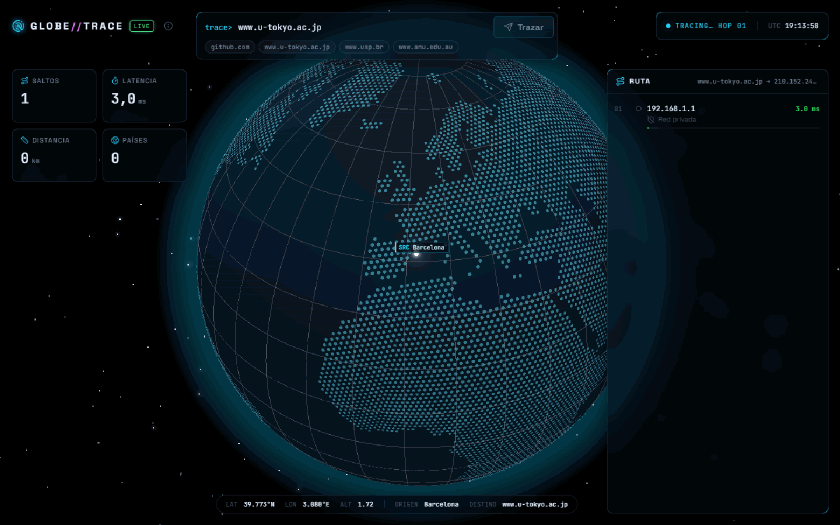
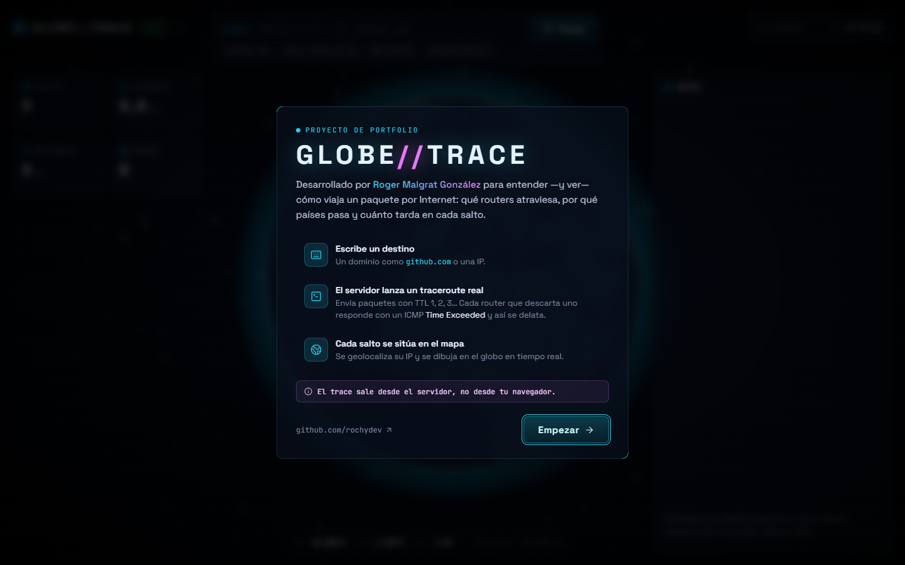
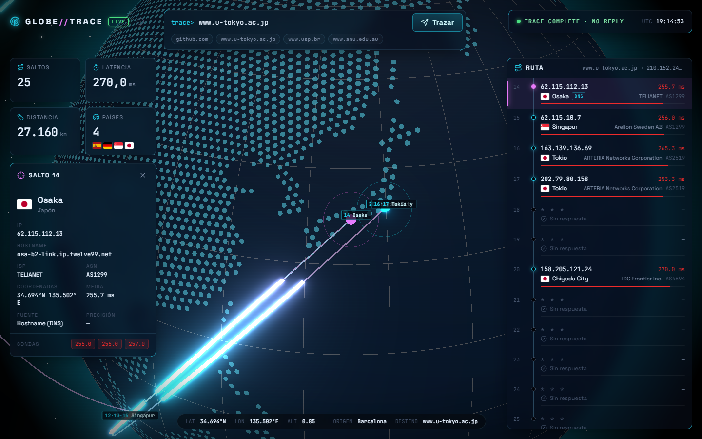
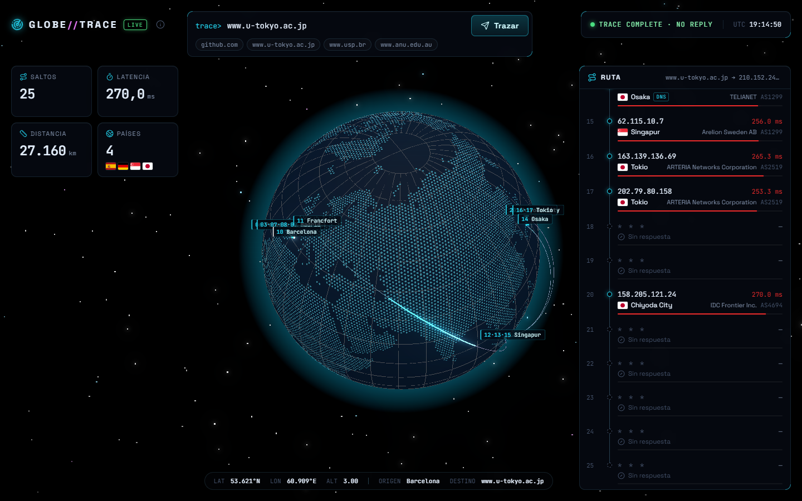
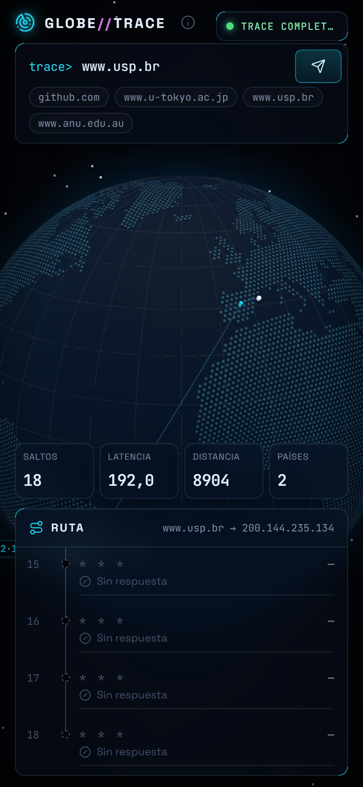
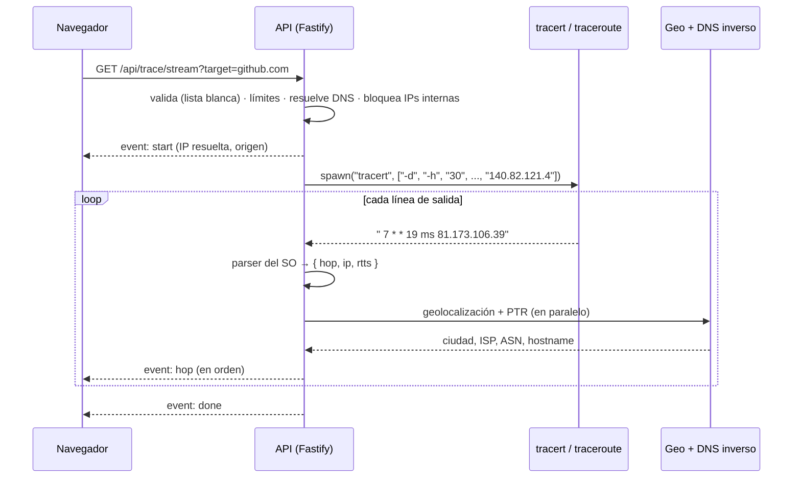

<div align="center">

# GLOBE//TRACE

**Traceroute real visualizado sobre un globo 3D, salto a salto y en tiempo real.**

Escribes un dominio o una IP, el servidor lanza un `traceroute` de verdad y la web dibuja
cómo viaja el paquete por el mundo: qué routers atraviesa, por qué países pasa y cuánto
tarda en cada salto.



<sub>Trace real desde Barcelona hasta <code>www.u-tokyo.ac.jp</code>: Madrid → Fráncfort → Singapur → Osaka → Tokio, 25 saltos y ~27 000 km.</sub>

</div>

---

> [!IMPORTANT]
> **El traceroute sale desde el servidor, no desde el navegador de quien visita la web.**
> Un navegador no puede enviar paquetes con TTL controlado ni recibir mensajes ICMP, así que
> la ruta que ves es la que sigue el tráfico **desde la máquina donde corre el backend**
> hasta el destino. Si el backend está en Barcelona, todas las rutas empiezan en Barcelona.

## Índice

- [Qué hace](#qué-hace)
- [Cómo funciona un traceroute](#cómo-funciona-un-traceroute)
- [Capturas](#capturas)
- [Puesta en marcha](#puesta-en-marcha)
- [Arquitectura](#arquitectura)
- [Seguridad](#seguridad)
- [Geolocalización: el problema difícil](#geolocalización-el-problema-difícil)
- [Decisiones técnicas](#decisiones-técnicas)
- [Configuración](#configuración)
- [Tests](#tests)
- [Limitaciones conocidas](#limitaciones-conocidas)

## Qué hace

- **Traceroute real en streaming.** Cada salto aparece en cuanto el router responde, sin esperar a que acabe el trace (Server-Sent Events).
- **Globo 3D.** Un punto por salto y un arco de luz entre saltos consecutivos con un pulso que lo recorre. La cámara sigue el recorrido y al final hace un plano general de toda la ruta.
- **Timeline de saltos.** Número, IP, ciudad y bandera, ISP/ASN y latencia con una barra de color verde → amarillo → rojo.
- **Casos reales bien tratados:**
  - IPs privadas (tu router, el CGNAT del operador).
  - Saltos sin respuesta (`* * *`).
  - IPs sin geolocalización.
  - Ubicaciones que son físicamente imposibles.

  Todos aparecen en la lista con su estado, pero no se dibujan en el globo.
- **Estadísticas.** Saltos, latencia final, distancia aproximada y países atravesados, con números que cuentan hacia arriba.
- **Detalle de cada salto.** Al hacer clic, la cámara vuela al router y muestra IP, hostname, ISP, ASN, coordenadas, fuente de la ubicación y las tres sondas.
- **Modo demo.** Sin backend, la web reproduce traces **reales** grabados previamente. Sirve para alojarla en un hosting estático o para grabar un vídeo sin depender de la red.
- **Interfaz tipo centro de operaciones de red (NOC).** Paneles de cristal esmerilado, brillo de neón (*bloom*) en los arcos, HUD con hora UTC y estado del trace. Se adapta a escritorio y móvil.

## Cómo funciona un traceroute

Cada paquete IP lleva un campo **TTL** (*Time To Live*) que cada router resta en 1. Cuando
llega a 0, el router descarta el paquete y devuelve un mensaje ICMP **Time Exceeded** a quien
lo envió.

`traceroute` aprovecha eso:

1. Envía paquetes con TTL = 1: el primer router los descarta y se delata con su IP.
2. Repite con TTL = 2, 3, 4… y en cada vuelta se descubre un router más del camino.
3. Para cuando responde el destino o se alcanza el máximo de saltos.

Se envían **tres sondas por salto** y se mide el tiempo de ida y vuelta (RTT) de cada una.
Un `*` significa que esa sonda no tuvo respuesta: muchos routers no contestan, o limitan los
mensajes ICMP, sin que eso signifique que el tráfico no pase por ellos.

## Capturas

| Pantalla de bienvenida | Detalle de un salto |
|---|---|
|  |  |

| Ruta completa a Tokio | Móvil |
|---|---|
|  |  |

## Puesta en marcha

### Requisitos

- **Node.js 22.9 o superior**.
- El comando de traceroute del sistema:
  - **Windows:** `tracert`, viene de serie.
  - **macOS:** `traceroute`, viene de serie.
  - **Linux:** `sudo apt install traceroute` (Debian/Ubuntu) o el paquete equivalente.

### Instalación

```bash
git clone https://github.com/rochydev/globe-trace.git
cd globe-trace
npm install
```

### Desarrollo

Hacen falta dos terminales:

```bash
npm run dev:server   # API en http://127.0.0.1:8790
```

```bash
npm run dev          # web en http://localhost:5195
```

Vite redirige `/api` al backend, así que no hace falta configurar CORS en local. Si la web
no encuentra el backend, arranca en **modo demo** y pasa sola a modo real en cuanto el
backend responde.

### Enlaces útiles

| URL | Qué hace |
|---|---|
| `/?t=github.com` | Lanza un trace directamente al abrir la página |
| `/?demo` | Fuerza el modo demo aunque haya backend |
| `/?demo&t=www.u-tokyo.ac.jp` | Reproduce un trace grabado al entrar (útil para grabar vídeo) |

### Producción

```bash
npm run build   # genera client/dist (estático, rutas relativas)
npm start       # arranca la API
```

El frontend es estático y se puede servir desde cualquier sitio (nginx, GitHub Pages…).
Si la API está en otro dominio, compila con `VITE_API_URL=https://api.ejemplo.com npm run build`
y añade ese origen del frontend a `CORS_ORIGINS` en el servidor.

### Scripts del servidor

```bash
npm run geo:update -w server                          # descarga las bases GeoLite2 de MaxMind
npm run demo:record -w server -- github.com otro.com  # graba traces reales para el modo demo
```

## Arquitectura

```
globe-trace/
├── shared/                 Código común a cliente y servidor (sin dependencias)
│   └── src/
│       ├── hop.js          Formato de un salto y su estado (ok, private, timeout, nogeo)
│       ├── target.js       Validación por lista blanca de dominio / IPv4 / IPv6
│       ├── net.js          IPs privadas y reservadas, distancia (haversine)
│       └── stats.js        Estadísticas del trace y color de latencia
├── server/                 API en Node.js + Fastify
│   ├── src/
│   │   ├── app.js          Montaje: plugins, manejo de errores, rutas
│   │   ├── config.js       Configuración por variables de entorno
│   │   ├── routes/trace.js /api/trace (JSON) y /api/trace/stream (SSE)
│   │   ├── lib/            SSE, límite de concurrencia, errores
│   │   └── services/
│   │       ├── traceroute/ Ejecución del proceso + un parser por sistema operativo
│   │       ├── geo/        MaxMind, ip-api, caché, pistas de hostname y física
│   │       ├── dns.js      Resolución del destino y DNS inverso de cada salto
│   │       └── origin.js   Ubicación del propio servidor
│   ├── scripts/            Descarga de GeoLite2 y grabación de demos
│   └── test/               Tests + salidas reales de tracert/traceroute
└── client/                 Web en Vite + JavaScript (módulos ES)
    ├── public/demo/        Traces reales grabados para el modo demo
    └── src/
        ├── globe/          Escena 3D (único sitio que conoce three / globe.gl)
        ├── stream/         Fuentes de datos: SSE en vivo y reproducción de demos
        ├── ui/             Paneles de la interfaz (no saben nada de 3D)
        └── main.js         Conecta fuente de datos ↔ globo ↔ interfaz
```

**Por qué esta estructura:**

- **Monorepo con *npm workspaces*.** El formato de un salto se define una sola vez en
  `shared` y lo importan los dos lados como un paquete (`@globe-trace/shared`). Si cambia,
  cambia en ambos a la vez.
- **Cada capa conoce lo mínimo de las demás.** La interfaz no importa three.js, la escena
  3D no sabe de dónde vienen los datos y `main.js` es el único punto que las conecta.
- **Las fuentes de datos son intercambiables.** El modo real y el modo demo tienen la misma
  interfaz, `startTrace(destino, { onStart, onHop, onDone, onError }) → { cancel }`, así que la
  interfaz no sabe cuál está usando.
- **Servicios inyectables en el servidor.** `buildApp({ services })` permite testear las
  rutas con un traceroute y un DNS falsos, sin ejecutar nada real.

### Flujo de un trace



## Seguridad

El destino que escribe el usuario acaba en un comando del sistema, así que es la parte que más
cuidado necesita. Hay varias barreras independientes: si una fallara, las demás siguen
protegiendo.

### 1. Validación por lista blanca

[`shared/src/target.js`](shared/src/target.js) no busca caracteres peligrosos: define con
precisión qué es válido y rechaza todo lo demás.

- **Dominio:** etiquetas de `[a-z0-9-]` sin guion al principio ni al final, al menos dos
  etiquetas y un dominio de primer nivel alfabético o punycode.
- **IPv4:** cuatro octetos de 0 a 255 sin ceros a la izquierda.
- **IPv6:** grupos hexadecimales con, como mucho, un `::`.

Así no hay que imaginar todos los ataques posibles (`;`, `|`, `$( )`, comillas invertidas,
`&&`…): simplemente no encajan. Antes de eso, Fastify ya ha validado con un esquema el tipo
y la longitud del parámetro.

### 2. `spawn` con argumentos, nunca una shell

```js
spawn('tracert', ['-d', '-h', '30', '-w', '1000', '-4', ip], { shell: false });
```

Cada elemento del array llega al programa como un argumento independiente y ninguna shell
interpreta su contenido. Lo peligroso sería
`exec("tracert " + entrada)`: ahí la entrada pasaría por `cmd.exe` o `/bin/sh`.

### 3. Al comando solo llega una IP

El dominio se resuelve en Node y a `traceroute` se le pasa **únicamente la IP validada**, nunca
el texto del usuario. Esto evita además la **inyección de argumentos**: aunque algo escapara a
la validación, un valor que empezara por `-` (por ejemplo `-w 999`) nunca llegaría al comando,
donde se leería como una opción.

### 4. Bloqueo de destinos internos (SSRF)

Se rechaza cualquier destino que resuelva a una dirección privada, de loopback, de enlace
local, de CGNAT, multicast o reservada, **también cuando se llega a ella a través de un
dominio** (`intranet.miempresa.com → 10.0.0.5`). Sin esto, cualquiera podría usar el servidor
para mapear la red interna en la que está desplegado, o sondear `169.254.169.254`, el servicio
de metadatos de los proveedores cloud.

### 5. Límites de uso

| Límite | Valor por defecto | Para qué |
|---|---|---|
| Rate limit por IP | 5 traces / minuto | Evitar abusos y que se use el servidor como herramienta de escaneo |
| Traces simultáneos | 1 por IP, 4 en total | Un trace dura hasta un minuto: el rate limit solo no evita tener muchos procesos vivos a la vez |
| Timeout por trace | 60 s | Pasado ese tiempo se mata el proceso |
| Saltos máximos | 30 (tope fijo de 64) | Acotar la duración y la salida |
| Corte por silencio | 5 saltos seguidos sin respuesta | No esperar hasta el salto 30 cuando el destino no contesta |

Las peticiones inválidas también consumen cupo del rate limit a propósito, para frenar a
quien prueba entradas en bucle.

### 6. Otros detalles

- **Sin procesos huérfanos.** Si el cliente cierra la conexión a mitad de un trace, el proceso
  de traceroute se mata y su hueco se libera. Hay un test que lo comprueba.
- **`TRUST_PROXY=false` por defecto.** Si se activara sin tener un proxy propio delante,
  cualquiera podría falsear la cabecera `X-Forwarded-For` y saltarse el rate limit.
- **Los datos externos nunca se interpretan como HTML.** Hostnames, ciudades e ISP llegan de
  fuera (un registro PTR lo controla el dueño de la IP), así que se insertan con `textContent`
  y no con `innerHTML`. Los PTR se filtran además a caracteres válidos de hostname.
- **Errores sin detalles internos.** Un fallo inesperado se registra completo en el servidor,
  pero al cliente solo le llega un mensaje genérico.
- **Escucha en `127.0.0.1` por defecto.** Para exponer la API hay que hacerlo de forma
  explícita, idealmente detrás de un proxy inverso con HTTPS.

## Geolocalización: el problema difícil

Ubicar un router a partir de su IP es mucho menos fiable de lo que parece. El proyecto combina
tres fuentes.

### 1. Base de datos: MaxMind GeoLite2 o ip-api.com

|  | MaxMind GeoLite2 (local) | ip-api.com (remoto) |
|---|---|---|
| Velocidad | Microsegundos, sin red | ~50–300 ms por IP |
| Privacidad | Ninguna IP sale del servidor | Las IPs de los saltos se envían a un tercero |
| Límites | Ninguno | 45 peticiones/min (se respetan sus cabeceras `X-Rl`/`X-Ttl`) |
| Puesta en marcha | Cuenta gratuita + descarga y actualización periódica | Nada |
| Licencia | Gratis con atribución | Solo uso no comercial; HTTP sin cifrar en el plan gratuito |

Con `GEO_PROVIDER=auto` se usa MaxMind si están las bases y, si no, ip-api. Si MaxMind no
conoce una IP, se pregunta también a ip-api. Solo se cachean los aciertos: un fallo puede deberse
a un timeout y no debe dejar la IP "sin ubicación" durante horas.

### 2. Pistas en el hostname del router

Las bases de datos suelen devolver **la sede del operador**, no la ubicación del router. En un
trace real, `r2-par1-fr.as5405.net` salía en Berlín estando en París. Pero los operadores
codifican la ciudad en el nombre DNS de sus routers:

```
r2-par1-fr.as5405.net              → par  = París
ae-4.r30.tokyjp05.jp.bb.gin.ntt.net → toky = Tokio
be2-sjo-b23.cogentco.com           → sjo  = San José
```

[`hints.js`](server/src/services/geo/hints.js) reconoce unos 70 códigos de ciudad (IATA y
abreviaturas de operador). Para evitar falsos positivos, si el nombre lleva un código de país,
tiene que coincidir con el de la ciudad. También ignora los prefijos de interfaz: el `be` de
`be2-sjo` es una interfaz *Bundle-Ethernet* de Cisco, no Bélgica. En la interfaz, estas
ubicaciones salen con la etiqueta **`DNS`**.

### 3. Comprobación por la velocidad de la luz

En fibra óptica la luz viaja a unos **200 km por milisegundo**. Como el RTT es de ida y vuelta,
un router con un RTT de *X* ms no puede estar a más de *X* × 100 km del origen.

En un trace real, la base de datos ubicaba un router en **Miami** con 16 ms de RTT desde
Barcelona, cuando harían falta al menos ~75 ms. Esas ubicaciones se marcan con ⚠ y quedan
fuera del globo y de las estadísticas, porque sumarían un arco y unos kilómetros que no existen.

### Cómo activar MaxMind

1. Crea una cuenta gratuita en <https://www.maxmind.com/en/geolite2/signup>.
2. Genera una *License Key* desde tu cuenta.
3. Copia `server/.env.example` a `server/.env` y rellena `MAXMIND_ACCOUNT_ID` y `MAXMIND_LICENSE_KEY`.
4. Ejecuta `npm run geo:update -w server` y reinicia el servidor.

MaxMind actualiza GeoLite2 dos veces por semana, así que conviene programar el script.

## Decisiones técnicas

**globe.gl en lugar de Three.js a mano.** globe.gl está construido sobre Three.js y ya
resuelve lo más laborioso: proyectar latitud y longitud, los arcos con trazos animados, los
puntos, las ondas, la atmósfera, la cámara con transiciones y las etiquetas HTML ancladas. Y
no encierra: `globe.scene()` y `globe.camera()` devuelven los objetos reales de Three.js.
Por eso el campo de estrellas y el post-procesado de *bloom* (`UnrealBloomPass`) son Three.js
puro.

**Server-Sent Events en lugar de WebSocket.** El trace es unidireccional: el servidor habla
y el cliente escucha. SSE es texto plano sobre HTTP normal, pasa por proxies sin
configuración especial y no necesita protocolo propio. Un comentario `: ping` cada 15 s
mantiene viva la conexión durante los silencios largos.

**`fetch` con stream en lugar de `EventSource`.** `EventSource` se reconecta solo al cerrarse
la conexión, y aquí eso lanzaría un trace nuevo sin que nadie lo pidiera. Además no deja leer
el código ni el cuerpo de una respuesta de error (un 429 o un 403 llegarían sin mensaje). Con
`fetch` se lee el cuerpo como stream, un pequeño parser une los eventos que la red parte por
la mitad, y cancelar es un `AbortController.abort()`.

**Un parser por sistema operativo, como funciones puras.** Línea de texto → salto, o `null`.
Se testean contra salidas reales sin ejecutar nada.

- El de Windows usa solo la estructura de columnas y no depende del idioma. La consola en
  castellano usa la página de códigos CP850 y se lee como `latin1`.
- El de Linux/macOS recorre la línea palabra a palabra para soportar el balanceo de carga
  (varias IPs en un mismo salto) y las anotaciones ICMP como `!H`.

**El orden de los saltos se garantiza en el servidor.** El hostname y la ubicación de cada salto
se piden en cuanto llega, en paralelo con el resto del trace. Como el salto 5 puede tardar más
que el 6, los envíos se encadenan en una promesa para que el cliente los reciba siempre en orden.

**Generador asíncrono para el proceso.** `runTraceroute()` es un `async function*` que emite
cada salto según aparece. Si quien lo consume deja de iterar (porque el cliente se ha
desconectado o ha habido un error), el `finally` mata el proceso.

## Configuración

Todas las variables tienen valor por defecto. La plantilla comentada está en
[`server/.env.example`](server/.env.example).

| Variable | Por defecto | Descripción |
|---|---|---|
| `HOST` / `PORT` | `127.0.0.1` / `8790` | Dirección de escucha de la API |
| `MAX_HOPS` | `30` | Saltos máximos (tope fijo de 64) |
| `TRACE_TIMEOUT_MS` | `60000` | Tiempo máximo de un trace |
| `PROBE_TIMEOUT_MS` | `1000` | Espera por sonda |
| `MAX_SILENT_HOPS` | `5` | Saltos seguidos sin respuesta antes de cortar |
| `RATE_LIMIT_MAX` / `RATE_LIMIT_WINDOW_MS` | `5` / `60000` | Traces por ventana y por IP |
| `MAX_CONCURRENT_TRACES` / `MAX_CONCURRENT_PER_IP` | `4` / `1` | Procesos vivos a la vez |
| `GEO_PROVIDER` | `auto` | `auto`, `maxmind`, `ipapi` o `none` |
| `ORIGIN` | — | Ubicación del servidor: `lat,lon,Ciudad,CC` |
| `CORS_ORIGINS` | — | Orígenes permitidos, separados por comas |
| `TRUST_PROXY` | `false` | Activar solo detrás de un proxy inverso propio |

## Tests

```bash
npm test
```

Hay 109 tests con Vitest, que también se ejecutan en GitHub Actions en cada push:

- **Parsers:** contra salidas reales de `tracert` (en castellano, CP850), en inglés, IPv6,
  Linux y macOS.
- **Proceso:** se emiten los saltos según llegan, se mata el proceso por timeout, por
  desconexión y por silencio, y nunca se usa una shell.
- **Rutas:** 11 entradas maliciosas (`; rm -rf /`, `$(whoami)`, `--help`…), 7 destinos internos
  bloqueados, rate limit y concurrencia.
- **Streaming:** orden de los eventos y orden de los saltos aunque se geolocalicen
  desordenados.
- **Geolocalización:** encadenamiento de proveedores, caché, límite de ip-api, pistas de
  hostname y comprobación física.

## Limitaciones conocidas

- **La ruta de vuelta no se ve.** Traceroute solo descubre el camino de ida, y en Internet la
  vuelta suele ser distinta (enrutamiento asimétrico).
- **Las CDN acortan el viaje.** Muchas webs grandes (`www.nhk.or.jp`, por ejemplo) se sirven
  desde un servidor cercano de Akamai o Cloudflare, así que el paquete nunca llega al país
  "de origen". Por eso los ejemplos usan universidades, que suelen alojarse en su propia red.
- **La geolocalización de routers es aproximada.** La comprobación física detecta ubicaciones
  *demasiado lejanas*, pero no las demasiado cercanas: un router a 190 ms ubicado en Madrid
  puede deberse a colas y no a un error.
- **La distancia es orientativa.** Es la suma de tramos en línea recta entre saltos
  geolocalizados; el cable real nunca va en línea recta.
- **Las líneas de continuación de macOS** (otra IP del mismo salto en una línea aparte) se
  ignoran y se conserva la primera respuesta.

## Licencia

[MIT](LICENSE) © Roger Malgrat González

Los datos de geolocalización de MaxMind GeoLite2 se distribuyen bajo su propia licencia
(<https://www.maxmind.com/en/geolite2/eula>) y no se incluyen en el repositorio.
